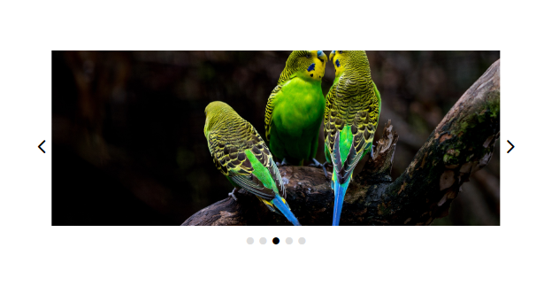

The component imge slider / carousel;

[How it works]

The images are stored in the "picArr" array. Any number of elements can be added to the array, both local files and links.
For example: "img/dog.png" or "https://cdn.pixabay.com/..../dog.jpg".

When the component loads, the script creates a div with the content of the carousel. When the right or left arrow is clicked, an image is retrieved from the "picArr" array. Then a new div is created with the background taken from the array. The created div is attached as a child in the Node "slider". The images are then moved. The div that is beyond the visibility area is removed. 
Navigation dots are created in the number of elements in the "picArr" array. 

[My solution site](https://shroomsky.github.io/Slider_component/)
